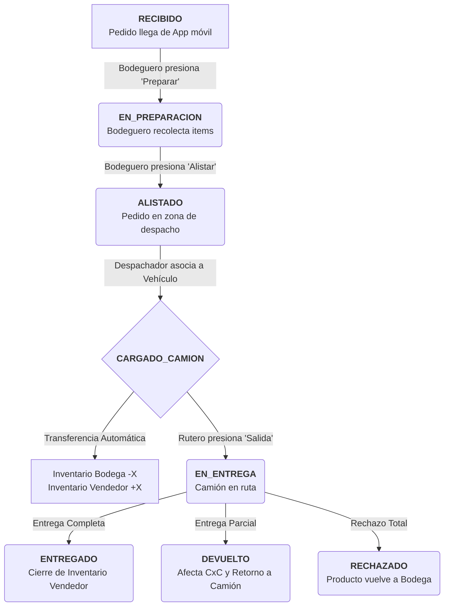

# 05 — Casos de Uso, Flujos y Escenarios (Logística LosPinos)

Este documento define la arquitectura lógica y el flujo operacional esperado por el cliente para el sistema MultiTienda (LosPinos). Su objetivo es alinear la implementación técnica con la expectativa del negocio.

---

## 1. Diagrama de Flujo Maestro (State Machine)

El siguiente flujo describe el ciclo de vida de un pedido desde que el vendedor lo toma en la calle hasta que se liquida en bodega.

---

## 2. Definición de Escenarios de Negocio (Bultos y Unidades)

El sistema maneja una dualidad constante entre **Bultos** (Cajas/Paquetes) y **Unidades** individuales.

### Escenario A: Configuración de Conversión
*   **Contexto**: El producto "Coca Cola 2L" se vende por unidad pero viene en caja de 6.
*   **Configuración**: `units_per_bulk: 6`.
*   **Lógica**: Si el sistema reporta 15 unidades en total, la UI y el Backend deben mostrar: **2 Bultos y 3 Unidades**.

### Escenario B: Ajuste Administrativo (Bodega)
*   **Evento**: El administrador encuentra una caja perdida y la ajusta manualmente.
*   **Entrada API**: `adjustStock(quantity: 6, type: 'IN')`.
*   **Resultado**: El balance de la bodega aumenta en 1 bulto exacto. El Kárdex registra tanto la unidad como el bulto equivalente.

### Escenario C: Carga de Camión (Transferencia Crítica)
*   **Evento**: Se cargan 3 bultos de un producto al camión de "Vendor Juan".
*   **Impacto en Bodega**: Se descuentan 18 unidades (si UPB=6) de la tabla `products`.
*   **Impacto en Rutero**: Se incrementan 3 bultos en la tabla `vendor_inventories` para "Vendor Juan".
*   **Realtime**: El móvil de Juan recibe un evento de Socket.IO que actualiza sus existencias locales inmediatamente sin refrescar.

---

## 3. Casos de Uso Principales

### CU-01: Preparación y Alistamiento (Web Bodeguero)
*   **Actor**: Bodeguero de Tienda.
*   **Objetivo**: Transformar una orden digital en un paquete físico listo para despacho.
*   **Flujo**:
    1.  El bodeguero ve el listado de pedidos en estado `RECIBIDO`.
    2.  Al seleccionar un pedido, el sistema bloquea el pedido (`EN_PREPARACION`).
    3.  El sistema genera un "Picking List" ordenado por **Departamentos** y **Pasillos**.
    4.  El bodeguero confirma la recolección de bultos y unidades.

### CU-02: Cobro en Ruta (App Móvil Rutero)
*   **Actor**: Vendedor/Rutero.
*   **Objetivo**: Registrar un pago de una factura previa o actual.
*   **Flujo**:
    1.  El rutero busca un cliente en su ruta.
    2.  Selecciona "Cobrar Saldo Pendiente".
    3.  Ingresa el monto (Efectivo/Transferencia).
    4.  El sistema crea un registro en `collections` y descuenta del `remaining_amount` de la cuenta por cobrar (`accounts_receivable`).

### CU-03: Cierre de Ruta (Liquidación)
*   **Actor**: Administrador + Rutero.
*   **Objetivo**: Conciliar mercancía no vendida y dinero recaudado.
*   **Flujo**:
    1.  El rutero regresa a bodega.
    2.  El sistema calcula: `Ventas Totales + Cobros - Mercancía en Mano`.
    3.  Se genera un `daily_closing` con el total de efectivo esperado.
    4.  La mercancía remanente en el camión vuelve al stock central de la bodega.

---

## 4. Matriz de Estados de Inventario

| Operación | Tabla: `products` | Tabla: `vendor_inventories` | Kárdex (Movements) |
|-----------|-------------------|-----------------------------|--------------------|
| Venta Directa POS | Disminuye (-) | No aplica | Registro OUT |
| Ajuste Inventario | Aumenta/Disminuye | No aplica | Registro IN/OUT |
| Carga de Camión | Disminuye (-) | Aumenta (+) | Registro OUT (Bodega) |
| Entrega en Ruta | No aplica | Disminuye (-) | No aplica |
| Devolución Rutero | Aumenta (+) | Disminuye (-) | Registro IN (Bodega) |

---

## 5. Glosario para el Cliente
*   **UPB (Unidades por Bulto)**: El factor multiplicador que define cuántos bultos resultan del stock total.
*   **Pick & Pack**: El proceso de recolectar el producto de la estantería (Picking) y ponerlo en el área de salida (Packing/Alistado).
*   **Saldo de Camión**: La cantidad de mercancía que el rutero tiene bajo su responsabilidad en un momento dado de la jornada.
